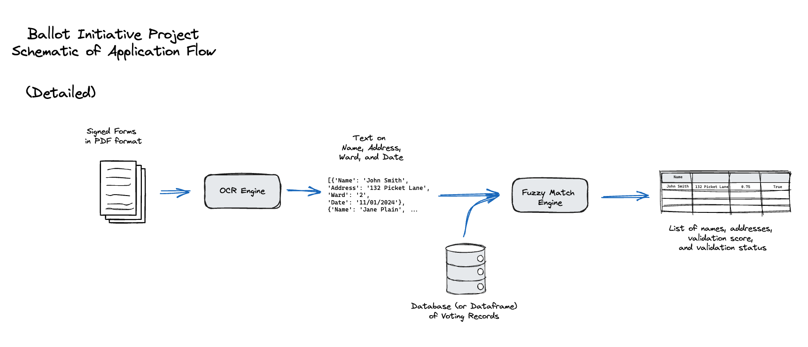

# 📚 Ballot Initiative Project:

The Ballot Initiative Project is an Open Source Tool to automate signature validation for ballot initiatives using OCR and fuzzy matching

Github: https://github.com/Civic-Tech-Ballot-Inititiave/Ballot-Initiative

Github Pages: https://civic-tech-ballot-inititiave.github.io/

Sponsored by [Civic Tech DC](https://www.civictechdc.org)

Slide Deck made using [Marp](https://marp.app/)

---

# 🤷‍♂️❓🤷‍♀️ What is a [Ballot Initiative](https://ballotpedia.org/Ballot_initiative)?

> A ballot initiative is a citizen-initiated ballot measure. The ballot initiative process allows citizens to propose statutes or constitutional amendments, depending on the state, and collect signatures to place their proposals on the ballot for voters to decide.

---

# 📋 Recently Passed Initiatives in DC

Year | Initiative | Description | Passed
-----|------|:-----:|------:
2024 | # 83 | Ranked-choice voting and open primary elections to independent voters | 72.89%
2022 | # 82 | Increase the minimum wage for tipped employees to the same level as non tipped employees | 73.94%
2020 | # 81 | Effectively decriminalize entheogenic plants and fungi | 72.89%

---

# ❌ [Current Process](https://www.washingtonpost.com/dc-md-va/2024/05/22/dc-voting-ballot-initiative-signatures/):

> **After a person signs on the dotted line, each signature must then be linked by name and address to an actual D.C. voter.** Though the Board of Elections will verify signatures when it receives petitions, Mintwood Strategies verifies them first.
>
> The initiative’s field director, typed names from the signature sheets into a database that linked the signature to a voter and checked for duplicates. Only when the signature was validated in this internal system would the person who collected it be paid for it.
>
> **It was slow, painstaking work. (The field director) struggled with a person’s middle name that was illegible.**

---

# ✅ Proposed Process

---

# ➕ Advantages:

* Lowers the cost curve of running a campaign
* Faster cycles of signature verification and threshold tracking
* Greatly eliminates a labor intensive/error prone process
* Potential instanteous verification

---

# 👨‍💻👩‍💻 Demo

[Web Application](https://ballot-initiative.streamlit.app)

[Petition File](https://github.com/Civic-Tech-Ballot-Inititiave/Ballot-Initiative/blob/main/sample_data/fake_signed_petitions_1-10.pdf)

[Registration File](https://github.com/Civic-Tech-Ballot-Inititiave/Ballot-Initiative/blob/main/sample_data/fake_voter_records.csv)

---

# 📽️ Video

<iframe src="https://drive.google.com/file/d/1bkCVFjqWWG508GyNrLsahfrGYmKCFZCS/preview" width="640" height="480" allow="autoplay"></iframe>

---

# 🤑 Costs

Approximately: 

* $1.00 to process 500 signatures

* Approximately 3 minutes to process 500 signatures

VS: 

* 45 minutes to manually process the same amount of signatures

---

# Next Steps:

* Improve the core OCR and validation aspects of the pipeline
* Business Development
* Improve the Web Application
* Organization
---

# ❤️ Contributors

* Mike Deeb
* Mobolaji Williams
* Kevin Yu
* Kurian Vithayathil
* Andrew Shao
* Brian Johnson

* Leland Perthal
* Paul Shaw
* Josh Wenk
* Julian Coy
* Yingquan Li

